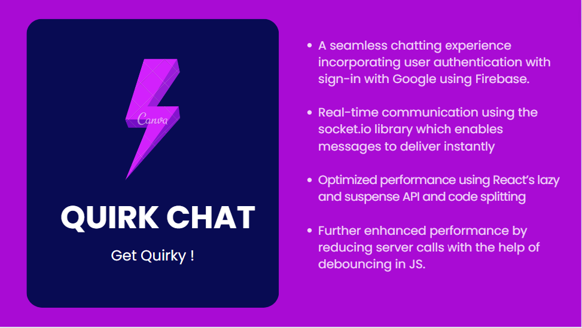

# Quirk-Chat⚡
Welcome to Quirk Chat⚡! 
<p align="center"></p>

# Demo💻

https://github.com/Atigit15/Quirk-Chat/assets/77894729/d3f84e6d-3272-4cd0-bd71-062c19a9a846

Note that it can time to load the dashboard once you click Log in, please be patient :)

# Features💫
- **Real-time Chatting**: Quirk Chat leverages the power of 'socket.io' to enable real-time communication between users. Messages are instantly delivered to recipients, ensuring a smooth and responsive chatting experience.

- **User Authentication**: The application includes a secure login and signup system. Users can create accounts, log in with their credentials, and access their chat rooms. Authentication is handled using secure encryption techniques.

- **Sign in with Google:** Users can easily sign in via their Google accounts. This was achieved by using Firebase authentication. After logging in with Google, the user must select their username and avatar. The application dynamically checks whether the current username is valid, and the server calls are minimized by incorporating debouncing.

- **User-Friendly Interface:** Quirk Chat offers a responsive, intuitive, and visually appealing interface, making it easy for users to navigate and interact with the application. The design focuses on simplicity and usability, providing a pleasant experience for all users.

- **Persistent Data Storage**: MongoDB is utilized as the database for Quirk Chat, ensuring reliable and efficient storage of user information and chat messages. The use of MongoDB allows for scalability and flexibility, accommodating the growth of the application and its user base.

# Installation⬇️
1. Clone the repository
```bash
git clone https://github.com/Atigit15/quirk-chat.git
```
2. Install dependencies
```bash
cd quirk-chat
npm install
```
3. Set up the environment variables:
  - Create a .env file in the root directory.
  - Specify the required environment variables in the .env file. For example:
  ```bash
MONGODB_URI=your-mongodb-connection-string
PORT=port on which you wish to run your server
REACT_APP_LOCALHOST_KEY="chat-app-current-user" 
ORIGIN=domain-name-string ("http://localhost:3000" if not hosted)
```
4. Start the development server
```bash
npm start
```
5. Open your browser and visit http://localhost:3000 to access Quirk Chat.

# Technologies Used🛠️
- React A popular JavaScript library for building user interfaces. React provides an efficient and reusable component-based architecture for Quirk Chat's front end.

- Node.js: A server-side JavaScript runtime environment. Node.js powers the backend of Quirk Chat, allowing for server-side logic and handling of real-time communication.

- Socket.io: A library that enables real-time, bidirectional communication between web clients and servers. Socket.io forms the core of Quirk Chat's real-time chat functionality.

- MongoDB: A NoSQL database that offers scalability and flexibility for storing and retrieving user information and chat messages. MongoDB integrates seamlessly with Quirk Chat's Node.js backend.

- MultiAvatar: An external API. Multiavatar is a multicultural avatar generator, which is free to use and open source.

# Deployment🖥️
The site's server code is uploaded on render.com and frontend (public or client) code is uploaded through Netlify.

# License📄
Quirk Chat is open source and available under the MIT License.

A special thanks to Kishan Sheth. Thank you for choosing Quirk Chat! We hope you enjoy using our real-time chat application and have meaningful conversations with others.

